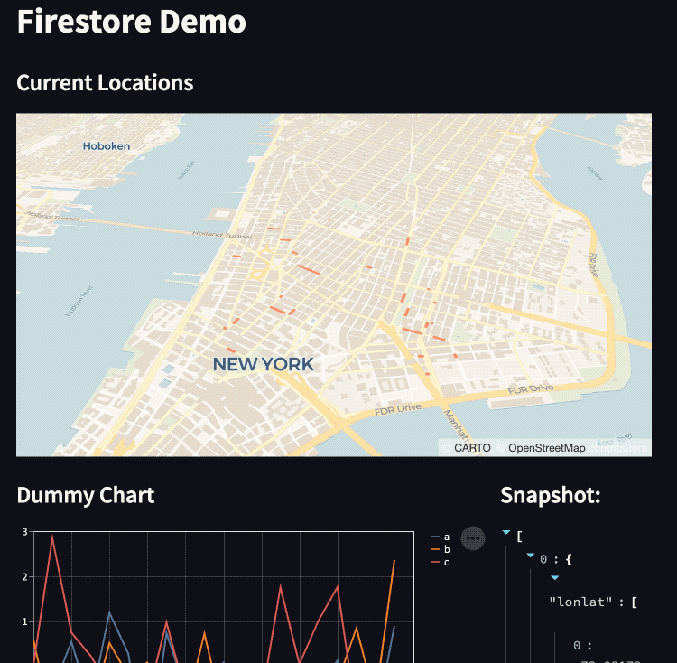

# cloudrun-mobility-dashboard
A lightweight real-time dashboard for mobility data. 



## Prerequisites
- Create a [Google Cloud project](https://cloud.google.com/docs/get-started)
- Create a [Firestore in Native Mode](https://cloud.google.com/firestore/docs/create-database-server-client-library#create_a_in_native_mode_database)

## Deploy
Run following code on Cloud Shell, or anywhere Google Cloud SDK installed.

```
$ gcloud run deploy mydashboard --source .
```

## Ingesting dummy mobility data
Run following python script on Cloud Shell, or anywhere Google Cloud SDK installed.

```
$ python3 ingest.py
```

## Debug on local
If you are using [Cloud Shell Editor](ide.cloud.google.com) or VS Code, click `"Cloud Code"` then select `"Run on Cloud Run Emulator"`.

You can also run the script directly. 
```
$ streamlit run app.py --server.enableCORS=false
```